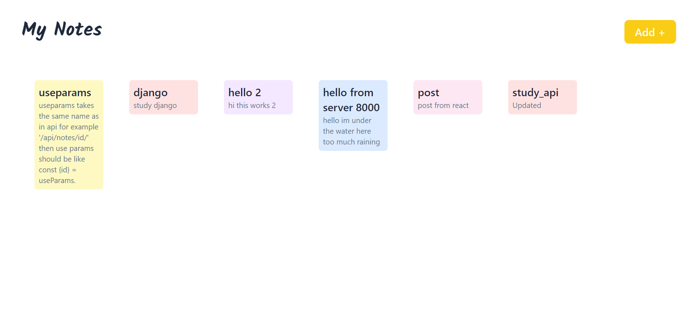
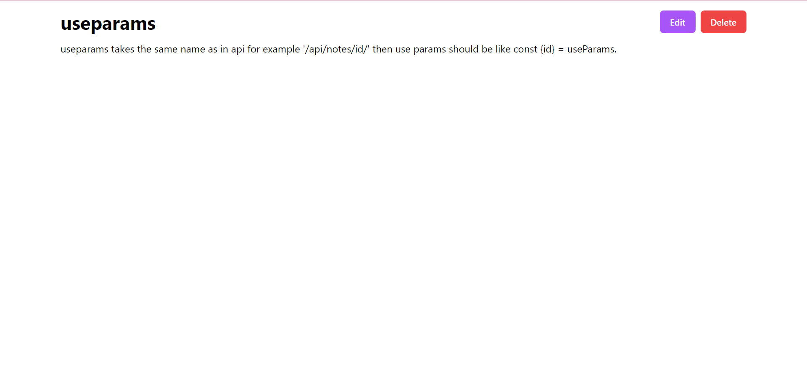
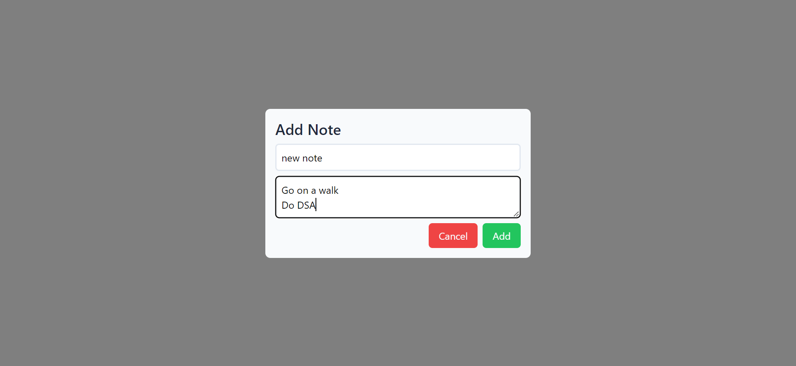

# React-Django-CRUD
**Django-React Notes App**

This repository contains a simple Notes app built with Django and React. The app allows users to perform CRUD (Create, Read, Update, Delete) operations on their notes. The backend is developed using Django, providing the API endpoints for the frontend, which is built using React.

## Features

- Create a new note
- View all notes
- Update existing notes
- Delete notes

## Technologies Used

- Django: A high-level Python web framework for backend development.
- React: A JavaScript library for building user interfaces.
- Django Rest Framework (DRF): A powerful and flexible toolkit for building Web APIs with Django.
- Axios: A popular HTTP client for making API requests from the React frontend.

## Setup Instructions

1. Clone the repository:

   ```
   git clone <repository-url>
   ```

2. Install the Python dependencies and create env and activate it:

   ```
   pip install -r requirements.txt
   python3 -m venv env
   .\env\Scripts\activate
   ```

3. Run the Django development server:

   ```
   python manage.py runserver
   ```

   The backend server will be accessible at `http://localhost:8000`.
   The DjangoRestFramework will be accessible at `http://localhost:8000/api`.

5. Navigate to the frontend directory and install the Node.js dependencies:

   ```
   cd frontend
   npm install
   ```

6. Run the React development server:

   ```
   npm run start
   ```

   The frontend server will be accessible at `http://localhost:3000`.

## API Endpoints

- `GET /api/notes/`: Get all notes
- `POST /api/notes/create`: Create a new note
- `GET /api/notes/:id/`: Get a specific note by ID
- `PUT /api/notes/:id/update`: Update a specific note by ID
- `DELETE /api/notes/:id/delete`: Delete a specific note by ID

## Folder Structure

- `api/`: Contains Django app 
- `notes_django/`: Contains Django Project 
- `frontend/`: Contains the React frontend code

## Screenshots





## Contributions

Contributions to improve the app or add new features are welcome! Please fork the repository and create a pull request.

## License

This project is licensed under the [MIT License](LICENSE).

---

Feel free to enhance the README with more information about the app, its architecture, and any additional setup instructions. You can also include information on how to deploy the app to production or any other relevant details.
